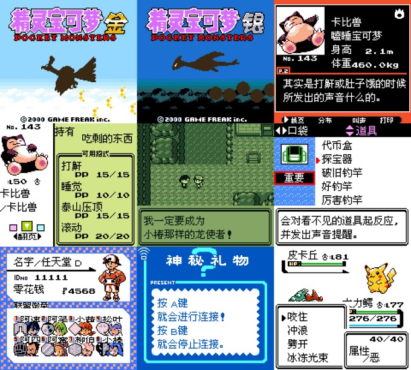

# Pokémon Gold / Silver Simplified Chinese Translation

[pret Original README.md](README.O.md)

[Translation Update History](VersionUpdate.md)

## Summary

- This game ROM uses a 2 MiB ROM + 64 KiB SRAM specification. The mapper is compatible with MBC30 (GB mode) or MBC3 (GBC mode).
- Due to technical limitations, the localized ROMs have two versions, GB compatible and GBC only. Detailed explanations are provided in the following sections.
- On a monochrome Game Boy, including Super Game Boy, the cartridge must support MBC30 with 64 KiB of SRAM to run properly. On a Game Boy Color, the cartridge only needs to support MBC3 with 32 KiB of SRAM. If the game reports "卡带没有足够的内存" (insufficient cartridge) memory during startup, please refer to the troubleshooting section below.

## About the Localized Versions

- This localized version is based on the English release at its core. You can trade Pokémon and start Link Battles with the US, EU, and Korean versions (with some limits), as well as localized versions based on those releases. 
- **Linking with the Japanese version, or localized versions based on the Japanese version is NOT supported!** Doing that will cause save data corruption on both sides. Do not attempt this!

- Although the localization is based on the US English version, the game content has been adjusted to be largely consistent with the Japanese version. Detailed explanations are provided in the following sections.

	
## How to Use the Patches
- Download the patches from the Releases section on GitHub and extract them. The .ips file is the ROM patch, used to convert the original game into the localized version. The .patch file is a 3DS Virtual Console fix patch, used to enable features such as wireless linking on the 3DS.
- Go to [https://www.marcrobledo.com/RomPatcher.js/](https://www.marcrobledo.com/RomPatcher.js/) and apply the patch on the website.
- Alternatively, use third-party tools such as MultiPatch to apply the IPS patch to the ROM.

## Scope of Patch Usage
- This project provides IPS patches only. After applying the patch to the original ROM, the original ROM will be converted into the localized version.
- Information about the IPS patch files:

|**Patch File Name**|**Version**|**Original File**|**Original ROM MD5**|
|:---:|:----:|:----:|:----:|
|pokegold.ips| Pokémon Gold Translation GBC Only  MBC3 32KB SRAM| English Pokémon Gold|a6924ce1f9ad2228e1c6580779b23878 |
|pokesilver.ips| Pokémon Silver Translation GBC Only  MBC3 32KB SRAM| English Pokémon Silver| 2ac166169354e84d0e2d7cf4cb40b312|
|pokegold_64KB.ips| Pokémon Gold Translation GB Compatible  MBC30 64KB SRAM| English Pokémon Gold|a6924ce1f9ad2228e1c6580779b23878 |
|pokesilver_64KB.ips| Pokémon Silver Translation GB Compatible  MBC30 64KB SRAM| English Pokémon Silver| 2ac166169354e84d0e2d7cf4cb40b312|

## Bugs Fixed Compared to the Original English Version
- Fixed a bug where the catching tutorial would freeze if the party Pokémon and PC boxes were both full.
- Fixed a bug where Pokémon caught after using the move “Transform” were always judged to be Ditto.
- Fixed a bug where burn, poison, and paralysis status conditions did not affect the capture rate.
- Fixed a bug where the item “Moon Ball” did not modify the capture rate.
- Fixed a bug where the item “Love Ball” only modified the capture rate for Pokémon of the same gender; it now increases the capture rate when the genders are different.
- Fixed a bug where the item “Fast Ball” only modified the capture rate for three Pokémon: Magnemite, Tangela, and Grimer.
- Fixed a bug where the “Glacier Badge” would sometimes fail to boost Special Attack during battles in single-player mode.
- Fixed a bug where the system only checked Pokémon in the first 9 PC boxes during the ID Lottery.
- Fixed a bug where the Pokémon massage by Green’s sister had a 0.04% chance of failing to increase Pokémon happiness.
- Fixed a bug where records would become corrupted if the player entered the Hall of Fame without ever saving once.
- Fixed a bug where certain text would fail to display after more than 200 Hall of Fame records.
- Fixed a bug where using the Coin Case under certain conditions would cause the game to execute invalid code.
- Fixed a bug where the HP reduction animation was too slow.

Adjustments Restored to Be Closer to the Japanese Version Compared to the Original English Version
- Adjusted:
	- To support Chinese character display, most of the UI has been adjusted to more closely match the Japanese version.
	- Pokémon Center and Poké Mart signboards have been restored to the Japanese-style designs.
	- In the battle interface, the “Pokémon” and “Bag” options have been swapped, restoring the Japanese layout.
	- NPC portraits, as well as the sprites of certain Pokémon including Jynx, have been restored to the Japanese-style artwork.
	- The animation for the move “Sonic Boom” has been restored to the Japanese version.
	- “Teddiursa” and “Ursaring” have been changed back to being Silver-exclusive Pokémon, while “Phanpy” and “Donphan” have been changed back to being Gold-exclusive Pokémon, matching the Japanese version.
	- US imperial system used in the game has been replaced with the metric system.
- Not adjusted:
	- The copyright year remains 2000, as in the English version.
	- The Super Game Boy (SGB) border remains the English version style.
	- Daylight Saving Time functionality and the in-game clock reset feature are still available.
	- Due to performance limitations of the monochrome Game Boy, the Pokédex detail pages use the same two-page layout as the Western versions.
	- The Pokémon storage system remains the same as the International releases, where each box can store 20 Pokémon, instead of the original Japanese version’s 30.
	- Japanese-version-exclusive bugs (such as the Bug-Catching Contest bug) were already fixed in the international versions and therefore remain fixed.
	- The currency unit remains the original English version’s Pokédollar symbol, consistent with the current official Chinese releases.

## Compatibility and Link Features

### Compatibility

- Due to technical limitations, the localized ROMs have two versions, GB compatible and GBC only.

	- The “GB compatible" ROM uses a 64KB SRAM header and must be used when playing on monochrome Game Boy hardware (DMG/MGB/SGB). When played on emulators, behavior may vary depending on emulator compatibility. 
	- The “GBC(CGB) only” ROM uses a 32KB SRAM header to ensure maximum compatibility in emulator environments, but it does not support play on monochrome Game Boy hardware. Aside from this difference, the two versions are otherwise identical.
	
	- Compatibility:

		|Runtime Environment \ Localized Version| GBC Only Run on DMG| GBC Only Run on CGB | GB compatible Run on DMG | GB compatible Run on CGB|
		|:-----:|:----:|:----:|:----:|:----:|
		|64KB MBC30 SRAM Catridges / Emulators| ❌No | ✅Yes | ✅Yes | ✅Yes |
		|32KB MBC3 SRAM Catridges| ❌No | ✅Yes | ❌No | ✅Yes |
		|Emulators that always emulate 32KB MBC3 SRAM|  ❌No | ✅Yes | ❌No | ✅Yes |
		|Emulators that emulate 0KB SRAM when MBC30 headers are detected| ❌No | ✅Yes | ❌No | ❌No |

		- The term "DMG" refers to the OG Game Boy, Game Boy Pocket, Game Boy Light, Super Game Boy, and Super Game Boy 2.
		- When playing on real hardware using GB/GBC flash cartridges, or on FPGA-based systems such as Analogue Pocket, the “GB compatible” version is recommended. The game will automatically detect the cartridge environment and decide whether it can run.
		- When playing on emulators, including emulators such as goombacolor used on GBA flash cartridges, the “GBC only” version is recommended. Only use the “GB compatible” version if you explicitly intend to play the game in monochrome or Super Game Boy mode.

 

### Save Migration Compatibility (for transferring saves from other versions)

| From this localized version / international Gold & Silver (excluding Korean)| From Japanese / Korean Gold & Silver| 
|:-----:|:----:|
| ✅ Supported | ❌ Not supported| 
	
- Saves from this localized version (older releases) and other international versions can be migrated. To avoid crashes, it is strongly recommended to save while standing on the entrance mat of a Pokémon Center before migrating the save, then migrate the save, exit the building immediately afterward, and save again. The detailed procedure is as follows:
	1.	Before starting, back up all files in the old version’s game directory.
	2.	Launch the old version of the game and use the “Save” function while standing on the entrance mat of any Pokémon Center.
	3.	Rename the new game ROM so that its filename matches the old version, then paste it to overwrite the old ROM.
	4.	Launch the game, choose “Continue,” then immediately exit the building and use “Save” again to complete the migration.

 

		
### In-Game Link Features

- Nintendo 3DS Virtual Console wireless linking has additional technical limitations. At present, even when using the VC patch, the VC search room feature still has issues.
		
- Linking within Gen II:
	
	| Feature | With the same versions | With International Versions123 |With CKN·群星 Pokémon Crystal Translation1| With Japanese versions5 | 
	|:-----:|:----:|:----:|:----:|:----:|
	| Pokémon trading | ✅ Supported| ✅ Supported | ✅ Supported |❌ Not supported|
	| Link battles | ✅ Supported| ✅ Supported | ✅ Supported |❌ Not supported|
	| Mystery Gift | ✅ Supported| ✅ Supported4 | ✅ Supported |❌ Not supported|
	- 1: Some UI may truncate overly long English Pokémon nicknames.
	- 2: When linking with the Korean version / Korean localized versions, please remove any held Mail from Pokémon on both sides. Chinese/Korean names may appear garbled, and overly long English names may overflow or be truncated.
	- 3: When linking with the Korean version, the following characters may cause abnormal behavior in this localized version. Please avoid using these characters in the Korean version:
	
			-  덥 로 벗 셰 엎 죔 층 팡 힝 갠 꿨 도 룟 볕 쇔 영 쥔 캔 펙
	- 4: Mystery Gift is not supported when linking with the Korean versions.
	- **5: Linking with the Japanese version is not supported. Forcing a link with the Japanese version may risk save data corruption. Please do not attempt this.**

- Linking with Generation I (Time Capsule):
	
	|Feature| With International Versions1 | With CKN·群星 Pokémon Yellow Translation v1.11 |With [TomJinW/pokeredCHS](https://github.com/TomJinW/pokeredCHS) [TomJinW/pokeyellowCHS](https://github.com/TomJinW/pokeyellowCHS) Translation 1 |With Japanese versions2 | 
	|:-----:|:----:|:----:|:----:|:----:|
	| Pokémon trading | ✅ Supported | ✅ Supported | ✅ Supported |❌ Not supported|
	
	
	- 1：Some UI may truncate overly long English Pokémon nicknames.
	- **2: Linking with the Japanese version is not supported. Forcing a link with the Japanese version may risk save data corruption. Please do not attempt this.**

	
 

### 3DS Virtual Console Link Features

- The 3DS Virtual Console modifies the ROM by applying a patch to the original version. This allows the wireless link menu to be launched from within the game and opened in the 3DS system. The 3DS Virtual Console only supports the "GBC only" version!
- Notes on the Virtual Console patch files:

 |**Patch filename**|**Used for**|
|:---:|:----:|
|pokegold.patch| Pokémon Gold Translation GBC Only  MBC3 32KB SRAM
|pokesilver.patch| Pokémon Silver Translation GBC Only  MBC3 32KB SRAM| 

- At present, .patch files only support wireless linking with the same version. Without modifying the VC program itself, cross-version linking between localized Gold/Silver/Crystal is NOT supported, linking with original Gen 2 versions is NOT supported, and Time Capsule linking with Gen 1 is NOT supported.
- With the .patch applied, reduced animation flicker and disabling original functions such as the Game Boy Printer should work normally.

- If you wish to create a link-capable 3DS Virtual Console yourself, you may use any official international Gen 2 Pokémon Virtual Console release as a base, replacing the ROM inside the VC along with the corresponding VC .patch file.
	
	| Title ID   Product Code | Gold | Silver |
	|:---:|:----:|:----:|
	|English|0004000000172600 CTR-N-QBPA|0004000000172700 CTR-N-QBQA|
	|French|0004000000172C00 CTR-N-QBVA|0004000000172D00 CTR-N-QBWA|
	|German|0004000000172900 CTR-N-QBSA|0004000000172A00 CTR-N-QBTA|
	|Spanish|0004000000172F00 CTR-N-QBYA|0004000000173000 CTR-N-QBZA|
	|Italian|0004000000173200 CTR-N-QB3A|0004000000173300 CTR-N-QB4A|
	- Using the Japanese VC as a base is not recommended. When using the Japanese VC, Poké Transporter is not supported, and wireless linking with other international 3DS Virtual Console versions is not possible.
			
 

- Virtual Console supports Poké Transporter. In Poké Transporter, the language of transferred Pokémon is determined by the VC Title ID, and the 3DS region and country is determined by the region of the Poké Transporter. Since this translation is based on the English version, if you are using a 3DS that is not in the EUR or USA region, you should configure the Luma locale to launch Poké Transporter in either the EUR or USA 3DS based on the language (Title ID) you use for the VC, to make the transferred Pokémon fully legal in Gen VII. Details are as follows:

	| Title ID Language  Pokémon Language | JPN/KOR/CHT/iQue  3DS | USA 3DS | EUR 3DS |
	|:---:|:----:|:----:|:----:|
	||Modify Poké Transporter’s Luma Locale configuration |||
	|English|Set to EUR or USA|No action required|No action required|
	|French|Set to EUR or USA|No action required|No action required|
	|Spanish|Set to EUR or USA|No action required|No action required|
	|German|Set to EUR|Set to EUR|No action required|
	|Italian|Set to EUR|Set to EUR|No action required|

### Other Link Features: 

- Compatibility with the following peripherals:
	|Feature| Status| 
	|:-----:|:----:|
	| Game Boy Printer | ✅Supported | 
	| Pokémon Pikachu 2 GS (USA)| ✅Supported | 

- Linking with the English N64 game Pokémon Stadium 2:

	|Feature| Status| 
	|:-----:|:----:|
	| Read save data (register battle teams)| ✅ Supported | 
	| Write back save data (organize boxes) | ⚠️ Notes required | 
	| GB Tower | ⚠️ Notes required | 

	- ✅: Save data can be read, and Pokémon can be registered into battle teams in the N64 game. The N64 game does not support displaying Chinese names.
	- ⚠️: If you use in-game features such as organizing Pokémon or boxes in “Prof. Oak’s Lab” within the N64 game, then write the save data back to the Game Boy cartridge, all Chinese Pokémon nicknames of the Pokémon operated on in the N64 game will be corrupted. Chinese OT names are not affected. If necessary, please use English Pokémon nicknames.
	- ⚠️: “Pokémon Stadium 2”: The GB Tower feature is usable, but due to the architecture of the localized version, more frequent loading may occur on the N64.

- Linking with the Japanese N64 game “ポケモンスタジアム 金銀”: ❌ Not compatible.

 

## Troubleshooting:
	
- Q: When starting the game in monochrome GB mode, the message “Not enough memory detected on the cartridge! When playing on a monochrome Game Boy, the cartridge must support 64 KB saves!” (没有检测到卡带上，有足够的内存！使用黑白机游玩时，卡带必须支持 64KB 存档！) appears:
	
	- A: When playing on a monochrome Game Boy (including the Super Game Boy series), the cartridge or emulator must support MBC30 with 64 KiB save memory for the game to run properly. Currently, relatively few cartridges support MBC30, so please confirm that your cartridge supports the 64 KiB save specification.

- Q: When starting the game in monochrome GB mode, the message “The GBC-only localized version does not support monochrome GB and SGB!” (GBC 专用汉化版不支持黑白 GB 和 SGB！) appears:
	
	- A: When playing on a monochrome Game Boy (including the Super Game Boy series), please use the “GB-compatible localized version.”
	
- Q: In GBC mode, when running the game using an emulator or a GBA flash cartridge, the message “Not enough memory detected on the cartridge! If playing on GBC or GBA, please use the GBC-only localized version!” (没有检测到卡带上，有足够的内存！如果使用GBC、GBA游玩时，请使用 GBC专用汉化版！) appears:

	- A: This indicates that the emulator detected the save specification of the “GB-compatible localized version” and chose to disable save emulation, causing the game to fail to run properly. In this case, please use the “GBC-only localized version” and run it in a simulated GBC environment.

- Q: When playing with a GBA flash cartridge (goombacolor), the game cannot save properly in-game:
	
	- A: goombacolor only supports the “GBC-only localized version.” In addition, after saving in-game, you must press L + R to bring up the goombacolor menu each time, so that the in-game save can be properly written to the GBA flash cartridge.

## How to Build the ROM from Source

- [Please refer to this (Simp. Chinese ONLY)](README.build.md)

## “Localization Team” Member List

- On the game’s initial menu, hold START and SELECT at the same time, then choose “New Game”（从头开始） to view the localization staff credits.

- Localization staff:
	- TomJinW  : Programming, Testing
	- colorcat : Testing
	- NELO     : Testing
	- 小光      : Art, Testing
	- 卧看微尘   : Art
	- 星夜之幻   : Assistance
	- 萌萌猪猪灵 : Text, Testing
	- 无敌阿尔宙斯 : Text, Testing

- Based on the CKN·DMG·口袋群星 Pokémon Crystal localization text; original Crystal localization translation by:
	- 萌萌猪猪灵、无敌阿尔宙斯、吃馍法师、伊布布布

- Based on the code of [TomJinW/pokeredCHS](https://github.com/TomJinW/pokeredCHS) [TomJinW/pokeyellowCHS](https://github.com/TomJinW/pokeyellowCHS), programmed by:
	- 星夜之幻、TomJinW

## Special Thanks
- [Nintendo](https://www.nintendo.co.jp)、[Game Freak](https://www.gamefreak.co.jp)、[Creatures](https://www.creatures.co.jp/)、[The Pokémon Company](https://corporate.pokemon.co.jp)

- [神奇宝贝百科](https://wiki.52poke.com/) [Bulbapedia](bulbapedia.bulbagarden.net) [tcrf.net](https://tcrf.net/Pokémon_Red_and_Blue)

## Third Party Tool License
- [Third-Party-License](Third-Party-License.txt)
